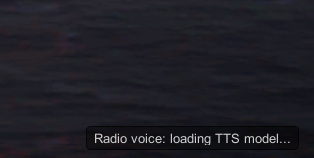

<div align="center">

# RadioChatter

**Immersive, dynamically voiced radio comms for [Nuclear Option](https://store.steampowered.com/app/2168680/Nuclear_Option/).**

Tower, AWACS, your own pilot, and mission chatter — spoken live from real game state,
not pre-recorded WAVs.

[](https://github.com/lnenad/radiochatter/releases/latest)
[](https://github.com/lnenad/radiochatter/releases)
[](https://github.com/lnenad/radiochatter/actions/workflows/release.yml)


</div>

```text
[TWR]     Falcon 1-1, winds calm, runway two seven, cleared for takeoff.
[PLAYER]  Cleared for takeoff runway two seven, Falcon 1-1.
[AWACS]   Falcon 1-1, Overwatch, new contact, bearing zero four five, forty four zero kilometers, hot.
[PLAYER]  Fox three!
[AWACS]   Splash one. Good kill, Falcon 1-1.
```

<div align="center">

[](https://www.youtube.com/watch?v=vPVlV0bkfTQ)

*▶ Click for a demo video*

</div>

RadioChatter is a [BepInEx 5](https://github.com/BepInEx/BepInEx) mod that watches live game
state and generates spoken radio traffic through a local
[Pocket TTS](https://github.com/kyutai-labs/pocket-tts) sidecar. Because lines are synthesized
on the fly, callouts carry real bearings, ranges, altitudes, runways, and callsigns from your
current mission.

The mod targets **singleplayer and host-side play**. Multiplayer clients are detected and the
mod disables itself rather than read state it does not own.

## Features

**Tower**
- Takeoff clearance, airborne handoff, inbound approach, landing clearance (read from the
  game's own UI message, including the runway number), and welcome-home calls.

**AWACS**
- New-contact BRA calls for freshly detected enemy aircraft.
- Picture updates for the nearest observed threat.
- Vectors to your currently selected target.
- Missile-threat warnings, kill confirmations, bingo-fuel and RTB advisories.
- Smart de-duplication: calls about the same contact share a cooldown, stale calls are dropped
  the moment they would play (destroyed target, expired info, already-covered contact).
- Automatic contact chatter quiets once the player is Winchester, or on the explicit voice command
  *"radio quiet"*. Urgent warnings and player-requested replies remain available.

**Player / pilot**
- Weapon-release calls: `fox one!`, `fox two!`, `fox three!`, `rifle!`, `magnum!`, `pickle!`,
  and `guns! guns! guns!`, classified from the actual weapon fired.
- Defensive calls for incoming missiles (`missile, break`) and an ejection mayday that
  interrupts everything else.
- Readbacks for tower clearances and airborne handoffs; short varied acknowledgements after other
  incoming comms, labeled by source (`[PLAYER-TWR]`, `[PLAYER-FLIGHT]`, `[PLAYER-AWACS]`). Tower
  readbacks are synthesized automatically by default, or can be spoken by the player with
  `RequireTowerReadbacks`.

**Mission / wingman comms**
- In-game scripted messages (`MissionMessages.ShowMessage`) are captured, cleaned up, and
  voiced on a separate wingman channel.
- Optional allied battlefield chatter reacts to real weapon releases, defensive reactions,
  takeoffs, landings, and aircraft losses without delaying higher-priority radio traffic.
- Friendly ground groups under hostile fire broadcast a general support request with a persistent
  callsign and a simple bearing/range location. Nearby vehicles share one request, preventing a
  platoon from flooding the radio. Address the group using both callsigns, then ask AWACS for vectors.

**Voice commands (push-to-talk)**
- Hold the push-to-talk key (default `Right Alt`), speak, release — your speech is transcribed
  locally by the sidecar (faster-whisper, no cloud) and answered in character.
- Incoming radio voices are reduced to 25% while push-to-talk is held, keeping the player's own
  transmission intelligible. The receive-volume multiplier is configurable.
- Accidental silent push-to-talk presses are discarded: voice activity detection must produce
  actual words before any player radio event is transmitted.
- Proper radio format is required by default: **station, callsign, request** —
  *"Tower, Falcon 1-1, request takeoff"* or *"Overwatch, this is Falcon 1-1, request picture"*.
  Skip the station and you get *"last calling station, say again with station and callsign"*;
  skip the callsign and you get *"station calling tower, say again your callsign"*
  (turn `RequireProperCalls` off for a looser mode).
- If you identify with a different callsign than the configured one, the controller plays
  along and answers to the callsign you actually used.
- Turn on `RequireTowerReadbacks` to replace synthesized Tower readbacks with real push-to-talk
  readbacks. Repeat the instruction, your callsign, and any assigned runway or handoff station,
  for example *"cleared for takeoff runway two seven, Falcon 1-1"*. Tower reports an incorrect
  readback and asks for it again; 10 seconds of silence also consumes an attempt and prompts a
  repeat. Tower waits for at most two response attempts, then reports that no valid readback was
  received and ends the exchange: takeoff is cancelled with a hold-position instruction, an
  arrival is sent around, or an unconfirmed handoff is treated as suspected radio failure. This
  flag only applies while voice commands are enabled. While a readback is pending, the normal
  subtitle container uses a muted amber background and a small `!` icon until the readback is
  accepted or the exchange ends.
- With voice commands on, comms are request-driven by default (`RequestDriven`): tower
  clearances and AWACS picture/vector info come when you ask, not automatically. AWACS still
  calls out brand-new contacts, missile threats, splashes, and bingo fuel on its own. Turn
  the flag off to get the fully automatic pre-voice behavior back.
- After Tower's airborne handoff, check in with AWACS — for example,
  *"Overwatch, Broadsword 1-1, airborne, checking in"*. AWACS confirms radar contact, then
  routine non-urgent AWACS traffic is released. Once the Tower handoff/readback exchange has
  finished, a persistent highlighted subtitle shows the required report and an exact example;
  it clears when AWACS accepts the check-in. Urgent missile warnings still cut through.
- Supported requests:
  - *"...request takeoff"* → takeoff clearance (or *"unable"* away from the field).
  - *"...request landing"* / *"inbound"* → landing clearance with runway, or *"continue inbound"*.
  - *"...request picture"* / *"bogey dope"* → BRA on the nearest contact, or *"picture clean"*.
  - *"...request vector to target"* → vector to your sorted target or the nearest contact.
  - *"...request objectives"* / *"objective list"* → AWACS reads the active objectives by
    name, each with bearing and range, closest first.
  - *"...vector to objective"* → bearing and range to the nearest active mission objective
    (by name) — your navigation when the objective markers are hidden.
  - *"...vector to objective radar site"* → a specific objective, matched loosely against
    the objective names — no need to recite *"Destroy the radar site at Kowal"* verbatim.
    A reference that matches nothing gets *"say again objective name"*.
  - *"...vector to home plate"* / *"request RTB"* → bearing and range to base.
  - *"Overwatch, Falcon 1-1, radio quiet"* → suppress routine automatic AWACS contact, picture,
    target-vector, and periodic RTB-vector calls. Flight direction is never used to infer this.
  - *"Overwatch, Falcon 1-1, resume calls"* / *"cancel radio quiet"* → restore normal automatic
    AWACS traffic, even if the aircraft is Winchester.
  - *"Anvil, this is Falcon 1-1, inbound, hold on"* → accept Anvil's support request. The wording
    is free-form; the transmission only needs the ground and player callsigns. The group number
    may be omitted while that callsign stem is unambiguous. The ground unit acknowledges and may
    ask for an ETA. Accepting another group cancels the previous support task.
  - *"Hammer 4, unable"* / *"negative Anvil, cannot assist"* → decline that request. A decline
    only needs the ground callsign and natural negative wording; the group acknowledges and stops
    hailing unless a genuinely new engagement begins after a quiet interval.
  - *"Overwatch, Falcon 1-1, request vector to Anvil"*, *"...vector to last support request"*,
    or *"...vector to secondary"* → AWACS gives that ground group's current bearing and range.
    A plain *"request vector"* keeps its original meaning (your selected or nearest air target),
    and ground-support vectors are never sent automatically.
  - *"...airborne, checking in"* / *"...with you"* → AWACS radar-contact acknowledgement.
  - *"...radio check"* → *"read you five by five"*.
  - A proper call the controller cannot make out gets an in-character *"say again"*.
- The recognized transcript is shown as a `[PILOT]` subtitle so you can see what was heard.

**Immersion (optional HUD/map decluttering)**
- Off by default; each behind its own flag in the `[Immersion]` config section.
- `HideObjectiveHudMarkers` removes the floating objective pointer/label from the HUD — ask
  AWACS for a *"vector to objective"* instead.
- `HideAirbaseHudMarkers` removes the floating friendly-airbase marker/label from the HUD;
  runway borders and the glideslope still appear on final approach, so you can still land.
  Ask Tower or AWACS for a *"vector to home plate"* instead.
- `HideMapObjectiveMarkers` clears objective markers from the tactical map; the MFD
  objective list keeps working, and *"vector to home plate"* gets you back to base.

**Presentation**
- Distinct configurable voice per role (tower, AWACS, player, wingman).
- Radio effect: band-limited voice, mild saturation, quiet configurable hiss.
- Same-channel serialization — tower never talks over tower — while different channels may
  overlap naturally after the initial takeoff exchange.
- Subtitles timed to audio playback, with a subtitles-only fallback when TTS is unavailable.
  Tower instructions awaiting readback reuse the same subtitle container with a tinted background
  and small alert icon, and remain visible until resolved.
- Pause-safe: pausing the game freezes the whole radio pipeline; nothing is skipped or lost.
- Fully customizable phrase templates via a drop-in `phrases.json` — no rebuild needed.

## Installation

### Prerequisites

1. [Nuclear Option](https://store.steampowered.com/app/2168680/Nuclear_Option/) installed.
2. [BepInEx 5.x](https://github.com/BepInEx/BepInEx/releases) (Mono build) installed into the
   game folder — run the game once afterwards so BepInEx creates its folders. Recommended
   setting in `BepInEx/config/BepInEx.cfg`:

   ```ini
   [Chainloader]
   HideGameManagerObject = true
   ```

3. Internet access for Python dependencies. The standard/lightweight downloads also fetch the
   Pocket TTS model (~235 MB) and faster-whisper `base.en` model (~148 MB) on first run. The
   separate **WithModels** downloads include both models and never contact Hugging Face at
   runtime. Python is *not* required: if no Python 3.10+ is found, the launcher automatically
   downloads [uv](https://github.com/astral-sh/uv) and a private, self-contained Python 3.12.

### Windows

1. Download one Windows installer from the
   [latest release](https://github.com/lnenad/radiochatter/releases/latest):
   - `RadioChatter-<version>-Setup.exe` — small download; models download on first run.
   - `RadioChatter-<version>-Setup-WithModels.exe` — larger download with TTS and STT models
     included; no Hugging Face/model download is needed.
2. Close Nuclear Option and run the installer.
3. Select your Nuclear Option game folder.
4. Leave *Prepare voice sidecar dependencies now* checked to set up the Python environment
   immediately. This can still need internet for Python packages even in the WithModels build;
   the WithModels build does not download model weights. If this step fails, check
   `BepInEx\plugins\RadioChatter\sidecar\sidecar-install.log` and rerun
   `BepInEx\plugins\RadioChatter\sidecar\run_sidecar.bat --install-only`.

### Linux

Download either `RadioChatter-<version>-linux.zip` (lightweight) or
`RadioChatter-<version>-linux-with-models.zip` (TTS and STT models included) from the
[latest release](https://github.com/lnenad/radiochatter/releases/latest), then:

```sh
unzip RadioChatter-<version>-linux-with-models.zip
sh install-radiochatter.sh --game-dir "$HOME/.steam/steam/steamapps/common/Nuclear Option" --yes
```

### First run

The plugin auto-starts the sidecar. If the sidecar environment was not prepared during
install, the launcher creates `BepInEx/plugins/RadioChatter/sidecar/.venv` and installs the
Python dependencies. Lightweight installs then download both models, so their first startup can
take several minutes. WithModels installs detect `MODEL_BUNDLE.json`, force Hugging Face offline,
and load the packaged models directly. Subsequent startups take a few seconds. Until the sidecar
is up, the mod shows subtitles only.

A small status indicator in the bottom-right corner tracks voice readiness — *connecting*,
*starting sidecar*, *downloading voice model* (first run only), *loading TTS model*,
*unavailable*, or *ready* (which disappears after a few seconds):



To install from source instead, see [Building from source](#building-from-source).

## Uninstall

Close Nuclear Option first. To remove the plugin, delete:

```text
<Nuclear Option>\BepInEx\plugins\RadioChatter
```

To remove saved RadioChatter settings as well, delete:

```text
<Nuclear Option>\BepInEx\config\com.lnenad.radiochatter.cfg
```

Do not delete `BepInEx` itself unless you want to remove BepInEx and other installed mods too.
If the sidecar is still running, stop any `python.exe` that was launched from the
`RadioChatter\sidecar` folder before deleting the plugin folder.

On Windows, the launcher may also create per-user Python bootstrap files outside the game
folder. These are safe to delete when RadioChatter is uninstalled:

```text
%LOCALAPPDATA%\RadioChatter
```

## Configuration

BepInEx writes the config to `<Nuclear Option>/BepInEx/config/com.lnenad.radiochatter.cfg`
after the first launch. Highlights: set `PlayerCallsign` to your preferred callsign, and use
the `Callouts` section to switch individual call types on or off.

<details>
<summary><strong>General</strong></summary>

| Key | Default | Meaning |
|---|---:|---|
| `Enabled` | `true` | Master switch. |
| `PlayerCallsign` | `Falcon 1-1` | Callsign used by tower/AWACS. |
| `AwacsCallsign` | `Overwatch` | AWACS station callsign in generated phrases. |
| `SubtitlesEnabled` | `true` | Shows bottom-center radio subtitles. |
| `PollIntervalSeconds` | `0.5` | Game-state polling interval, clamped from `0.1` to `2`. |
| `SidecarStatusDisplay` | `true` | Small bottom-right voice status indicator (connecting/starting/downloading/loading/unavailable); the "ready" notice hides after a few seconds. |

</details>

<details>
<summary><strong>Sidecar</strong></summary>

| Key | Default | Meaning |
|---|---:|---|
| `Url` | `http://127.0.0.1:5075` | Base URL for the Pocket TTS sidecar. |
| `AutoStartSidecar` | `true` | If enabled, tries to launch the sidecar when `/health` is down. |
| `SidecarCommand` | empty | Path to a sidecar launcher script. |
| `StopSidecarOnExit` | `true` | Stop the auto-started sidecar when the game exits. |
| `CacheSize` | `100` | Max synthesized clips kept in the in-memory TTS cache. |

If `AutoStartSidecar` is enabled, either set `SidecarCommand` to a launcher script, or keep
the `sidecar` folder next to the plugin in `BepInEx/plugins/RadioChatter/sidecar` (the
installers and build scripts put it there). A sidecar the plugin started is stopped again
when the game exits (`StopSidecarOnExit`); a sidecar you started manually is never touched.

</details>

<details>
<summary><strong>Audio</strong></summary>

| Key | Default | Meaning |
|---|---:|---|
| `Volume` | `0.8` | Voice playback volume. |
| `RadioEffectEnabled` | `true` | Applies the radio effect to generated clips. |
| `NoiseLevel` | `0.015` | Very light transmission hiss amount. |
| `PushToTalkReceiveVolume` | `0.25` | Incoming-radio volume multiplier while push-to-talk is held. `0` mutes receive audio; `1` disables ducking. |
| `MaxConcurrentTransmissions` | `3` | Max different radio channels that may overlap. |
| `TowerVoice` | `tower` | Sidecar voice alias for tower calls. |
| `AwacsVoice` | `awacs` | Sidecar voice alias for AWACS calls. |
| `PlayerVoice` | `player` | Sidecar voice alias for player/pilot calls. |
| `WingmanVoice` | `wingman` | Sidecar voice alias for captured mission comms. |

Same-channel chatter is serialized regardless of `MaxConcurrentTransmissions`.

</details>

<details>
<summary><strong>Callouts</strong></summary>

| Key | Default | Meaning |
|---|---:|---|
| `Takeoff` | `true` | Tower takeoff and airborne calls. |
| `Landing` | `true` | Tower landing clearance and welcome-home calls. |
| `Approach` | `true` | Tower inbound approach call. |
| `NewContact` | `true` | AWACS new-contact BRA calls. |
| `ContactInfoCooldownSeconds` | `35` | Minimum seconds between AWACS calls about the same contact (new contact, picture, vector), unless its range or aspect changes significantly. |
| `PictureUpdate` | `true` | Periodic AWACS picture calls. |
| `PictureIntervalSeconds` | `45` | Minimum seconds between picture calls. |
| `VectorToTarget` | `true` | AWACS calls for the selected target, suppressed inside 4 km. |
| `VectorIntervalSeconds` | `20` | Minimum seconds between target vector calls. |
| `SplashCalls` | `true` | Player kill confirmations. |
| `MissileWarning` | `true` | Defend calls for missiles targeting the player. |
| `PlayerWeaponCalls` | `true` | Pilot weapon-release calls such as fox, rifle, magnum, pickle, and guns. |
| `PlayerDefensiveCalls` | `true` | Pilot defensive calls for incoming missiles. |
| `PlayerEjectionCalls` | `true` | Pilot mayday call when the player ejects. |
| `PlayerAcknowledgements` | `true` | Short varied pilot acknowledgements after incoming radio calls finish. |
| `InGameComms` | `true` | Reads mission-scripted comms through the wingman voice. |
| `RtbCalls` | `true` | Low-fuel and sustained inbound return-to-base advisories. |
| `BattlefieldChatter` | `false` | Opt-in allied-aircraft chatter for weapon releases, defensive reactions, takeoffs/landings, and losses. One ambient call can be selected every 18 seconds; events expire while the radio is busy instead of building a TTS backlog. |
| `GroundSupportRequests` | `true` | Friendly ground groups under hostile fire broadcast a general request for air support. Requires voice commands so requests can be accepted. |
| `GroundSupportGroupRadiusM` | `1000` | Vehicles within this radius share one mission-persistent ground callsign and request. |
| `GroundSupportRepeatSeconds` | `120` | Repeat interval for an unaccepted support hail. |
| `QuietAwacsWhenWinchester` | `true` | Quiet automatic new-contact, picture, target-vector, and periodic RTB-vector chatter when out of offensive weapons. Returning home is never inferred; use *"radio quiet"* explicitly. Missile/bingo warnings and requested replies still work. |

</details>

<details>
<summary><strong>VoiceCommands</strong></summary>

| Key | Default | Meaning |
|---|---:|---|
| `Enabled` | `true` | Push-to-talk voice commands (needs a microphone). |
| `RequireProperCalls` | `true` | Require "station, callsign, request" format; malformed calls get a corrective reply. Off = station and callsign are optional. |
| `RequireTowerReadbacks` | `false` | Replace automatic synthesized Tower readbacks with player-spoken readbacks. Takeoff/landing readbacks must repeat the clearance, callsign, and assigned runway; handoffs must repeat the switch/contact instruction, callsign, and handoff station. Tower allows two attempts, correcting an invalid attempt or prompting after 10 seconds of silence. After the second failure it cancels takeoff and says hold position, sends an arrival around, or reports an unconfirmed handoff/radio failure. Only applies while voice commands are enabled. |
| `RequestDriven` | `true` | Pull, not push: tower clearances (takeoff, approach, landing) and AWACS picture/vector/RTB-advisory calls must be requested by voice. New contacts, missile warnings, splashes, and bingo fuel stay automatic. Off = everything is announced automatically, as before voice commands. Only applies while voice commands are enabled. |
| `PushToTalkKey` | `RightAlt` | Hold to record a command, release to send. Any Unity `KeyCode` name works, including `Mouse3`/`Mouse4`. |
| `MicrophoneDevice` | empty | Microphone device name; empty uses the system default. |
| `MaxCommandSeconds` | `8` | Longest recorded command; recording stops automatically after this. |
| `ShowRecognizedText` | `true` | Show the recognized transcript as a `[PILOT]` subtitle. |

Speech is transcribed by the sidecar's local faster-whisper model (`base.en`, ~75 MB,
downloaded on first run next to the TTS model). Nothing leaves your machine. The first voice
command right after game start is ignored if the model is not ready yet; wait for the voice
status indicator to report ready and key up again.

</details>

<details>
<summary><strong>Immersion</strong></summary>

| Key | Default | Meaning |
|---|---:|---|
| `HideObjectiveHudMarkers` | `false` | Hide the floating objective pointer and label on the HUD. |
| `HideAirbaseHudMarkers` | `false` | Hide the floating friendly-airbase marker and distance label on the HUD (runway borders and glideslope still show on final). |
| `HideMapObjectiveMarkers` | `false` | Hide objective markers on the tactical map (the MFD objective list keeps working). |

All three are meant to pair with voice commands: with the markers gone, *"request vector to
target"* and *"vector to home plate"* become how you actually navigate. Turning a flag off
restores the map filter to whatever it was before.

</details>

## Customizing voices

Voice aliases are configured in [sidecar/voices.json](sidecar/voices.json):

```json
{
  "default": "eve",
  "eve": "eve",
  "tower": "eve",
  "awacs": "vera",
  "player": "george",
  "wingman": "paul"
}
```

The plugin requests these aliases through the `Audio.*Voice` config keys. To change a role's
voice, edit `voices.json` and restart the sidecar. If you change a voice ID in the BepInEx
config, make sure the same alias exists in `voices.json`.

## Customizing phrases

All tower/AWACS phrase templates live in
[src/RadioChatter/Speech/phrases.json](src/RadioChatter/Speech/phrases.json), embedded into
the DLL at build time. At startup the plugin loads phrases from the first of:

1. A loose `phrases.json` next to the deployed DLL:
   `<Nuclear Option>/BepInEx/plugins/RadioChatter/phrases.json`
2. The copy embedded in the DLL.

To customize callouts without rebuilding, copy `phrases.json` next to the deployed DLL and
edit it. Delete the loose file to revert to the built-in phrases.

The format is one array of template variants per event key:

```json
{
  "awacs_missile": [
    "defend, defend, missile inbound bearing {bearing}",
    "{callsign}, missile inbound, defend, bearing {bearing}"
  ]
}
```

A random variant is picked per call, avoiding the last-used one. `{slot}` placeholders are
filled per event; the available slots are `{callsign}`, `{awacs}`, `{runway}`, `{bearing}`,
`{bearing_clause}`, `{range}`, `{altitude}`, `{altitude_clause}`, `{aspect}`, and `{type}`, plus
`{ground_callsign}` for ground-support keys (which keys receive which slots matches the built-in
file). Write numbers as words — text is
sent to TTS as-is.

The BepInEx log reports which source was loaded, e.g.
`Loaded 13 phrase banks from embedded resource.` If the file is missing or malformed, an error
is logged and radio calls fall back to speaking raw event keys such as `awacs_rtb_fuel`.

## How it works

```text
game state ────► GameAdapter ──► StatePoller ──► CommsDirector ──► RadioAudioPlayer
Harmony patches ──► RadioEventBus ────────────────┘                      │
                                                                Pocket TTS sidecar
                                                               (localhost HTTP, WAV)
```

1. `CommsDirector` watches polled game state and Harmony events, decides which line to say,
   and manages priorities, cooldowns, and the transmission queue.
2. `PocketTtsClient` checks an in-memory cache or requests WAV audio from the local sidecar.
3. `RadioAudioPlayer` applies the radio effect offline to the PCM samples and plays the clip
   through a temporary 2D Unity `AudioSource`.

Different roles may overlap, but a role never overlaps itself: AWACS can talk over the
wingman, but two wingman lines play sequentially. Subtitles appear when audio playback
begins, not when a line is queued. While the game is paused the whole radio pipeline freezes:
playing lines pause and resume, queued lines are held without expiring, and subtitles stay on
screen. Nothing is skipped or lost because of a pause.

<details>
<summary><strong>Tower callout logic</strong></summary>

- Takeoff clearance fires when the player is stably grounded near a friendly airbase at
  mission start.
- Airborne handoff fires after transitioning from grounded to airborne near the airbase.
- The approach call requires sustained inbound flight:
  - within `35 km` of the home airfield,
  - closing on the airfield,
  - under `3500 m AGL`,
  - showing approach intent by heading generally toward the field, descending, gear down, or
    already inside `12 km`,
  - held for `22 seconds` with a short grace window for heading/altitude corrections,
  - and within `16 km` when the call plays.
- Final landing clearance uses the game's own UI message, such as `Cleared to land runway 27`,
  instead of trying to infer final approach. Runway numbers are parsed from the UI message,
  including `runway 27L`, `runway 27 L`, and `RWY 27`.
- Landing/welcome-home fires on successful sortie or stable landing near the friendly airbase.

</details>

<details>
<summary><strong>AWACS callout logic</strong></summary>

- New contacts come from the local faction tracking database and only include currently
  observed enemy aircraft.
- Picture updates use the nearest observed enemy contact. While a target is selected (and
  vector calls are enabled), the picture skips that contact — the vector call owns it — and
  covers the next nearest threat instead.
- Target vectors use the player's currently selected target.
- New-contact, picture, and vector calls share a per-contact cooldown
  (`ContactInfoCooldownSeconds`), so AWACS does not repeat the same facts about one contact
  back to back. It breaks in early only when the situation changes: the contact turns hot, or
  its range moves by about a quarter.
- When a player kill is confirmed, queued and in-progress vector calls are cut before the
  splash call plays, so AWACS does not give a vector to a target that is already down.
- Informational calls are re-checked the moment they would actually play: calls about a
  contact that has since been destroyed are dropped, once one call about a contact plays any
  queued repeats about it are discarded, and a new-contact/picture/vector clip that could not
  start within ~12 seconds (busy channel, slow TTS) is thrown away rather than played late.
- Missile warnings come from missiles locking the local aircraft.
- Splash/good-effect calls use the local kill display event.
- RTB calls include a one-time bingo-fuel advisory below about 18 percent fuel and a
  home-plate vector after roughly 18 seconds of sustained inbound flight from 18-90 km out.
- With `QuietAwacsWhenWinchester` enabled, live offensive weapon-station ammunition suppresses
  automatic new-contact, picture, target-vector, and periodic RTB-vector chatter once all weapons
  are expended. Flight direction is never interpreted as a desire for radio silence.
- The player can explicitly request the same quiet mode with *"Overwatch, Falcon 1-1, radio quiet"*
  and restore normal traffic with *"resume calls"* or *"cancel radio quiet"*. Missile warnings,
  bingo fuel, kill confirmations, ground traffic, and all push-to-talk requests still pass through.

</details>

<details>
<summary><strong>Ground-support request logic</strong></summary>

- A request can begin when a hostile weapon station fires at a friendly `GroundVehicle`, or
  when positive damage with hostile attribution is recorded. The damage hook covers unguided
  and area weapons whose launch did not carry an explicit target.
- Attacks are clustered around the first vehicle in a `GroundSupportGroupRadiusM` radius.
  Vehicles in that cluster share one callsign (`Anvil`, `Hammer`, `Bison`, `Ranger`,
  `Sentinel`, or `Nomad`, with a persistent number) for the rest of the mission.
- The hail is addressed to any available aircraft rather than directly to the player. It gives
  bearing and range from the player's current position and explains how to respond. The reply may
  use any natural wording, but must contain both the ground callsign and the configured player
  callsign. The group's numeric suffix may be omitted while its stem is unique among available
  requests.
- Unaccepted groups repeat their request every `GroundSupportRepeatSeconds`. Fire from another
  vehicle in the same cluster updates the existing group instead of creating another hail.
- A player can decline with the ground callsign plus broad negative wording, such as *"Hammer 4,
  unable"*, without also reciting the player callsign. The local request is dismissed and will not
  repeat under continuous fire; the same persistent group may call again only after a full quiet
  interval followed by a new attack.
- Accepting a request makes it the active secondary support task. The ground unit acknowledges,
  with responses such as *"roger, please hurry"* or *"what is your ETA?"*. Further transmissions
  containing both callsigns receive a short ground acknowledgement. Automatic pilot
  acknowledgements are suppressed for ground traffic and questions, so an ETA request waits for
  the player's actual reply.
- AWACS does not send automatic support updates. Ask for *"vector to Anvil"* (or another ground
  callsign), *"vector to last support request"*, or *"vector to secondary"* to get the requested
  group's current bearing/range. A plain *"request vector"* remains reserved for the selected or
  nearest air target. Accepting a different group dismisses the previous task and makes it the
  new secondary.
- If no living friendly ground vehicle remains in the group, queued guidance is removed and
  AWACS cancels the support task. Missile warnings and other urgent traffic retain priority.

</details>

<details>
<summary><strong>Player / pilot chatter logic</strong></summary>

Player weapon calls are detected from local `WeaponManager.Fire()` events, with lower-level
weapon hooks kept as fallback. The classifier uses Nuclear Option `WeaponInfo` role fields and
weapon names:

- `fox one!`: semi-active radar-guided air-to-air missile.
- `fox two!`: infrared air-to-air missile.
- `fox three!`: active radar or otherwise radar/BVR-style air-to-air missile, including AAM
  Scythe.
- `rifle!`: air-to-ground missile (every A2G missile except the ARAD).
- `magnum!`: the ARAD anti-radiation missile — the game's only anti-radiation weapon.
- `pickle!`: bomb or glide-bomb release.
- `guns! guns! guns!`: gun or cannon fire.

Incoming missiles take priority over everything. A fresh threat cuts off whatever routine call
(AWACS target/picture, tower, wingman) is mid-transmission and drops the pending queue, then the
warning goes out immediately and routine AWACS info stays quiet for a few seconds. Both the AWACS
warning and the pilot's defensive call carry an escape vector — a `break left` / `break right`
that beams the threat (turns to drive it onto the 3/9 line with the smaller turn): the pilot
calls `missile, break right!` while AWACS calls `defend, defend, missile inbound bearing zero
nine zero, break right`. Closely-spaced launches queue behind one another rather than cutting each
other off.

Player ejection is detected from the local aircraft ejected state and interrupts current
chatter so the pilot call plays immediately: `mayday! mayday! ejecting!`. This mayday is
suppressed when the player ejects from a non-destroyed aircraft safely on the ground at a
friendly airbase, since that is the normal exit-aircraft mechanic. If the local aircraft is
destroyed without an ejection, active and queued chatter is interrupted and AWACS calls the
aircraft down, e.g. `Darkstar, Broadsword 1-1 is down, no chute`.

If a weapon maps incorrectly, enable BepInEx debug logging and check the
`Player weapon call:` log entry for the exact weapon display name.

After incoming tower, AWACS, or wingman comms finish and the non-player radio queue is
drained, the player channel may respond. Tower takeoff clearance, landing clearance, and
airborne handoff get specific readbacks; other comms get short varied acknowledgements. If
overlapping tower/AWACS/wingman lines finish together, multiple player responses are queued
and played sequentially on the shared player channel. Responses are coalesced by source while
one is already pending or playing, so a batch of AWACS calls gets one `[PLAYER-AWACS]`
response and a batch of flight chatter gets one `[PLAYER-FLIGHT]` response. Missile/defend
calls are excluded so they do not get casual acknowledgements during defensive moments.

With `VoiceCommands.RequireTowerReadbacks = true`, those three Tower readbacks are not
synthesized. Once the Tower transmission finishes, the expected readback is tracked until the
player speaks it through push-to-talk. A valid clearance readback includes `cleared for takeoff`
or `cleared to land`, the addressed callsign, and the complete runway when one was assigned; a
valid handoff includes `switch`/`contact`, the callsign, and the named handoff station. Tower
calls an incorrect readback and requests a repeat. A 10-second silence is also a failed attempt.
After two failed attempts, Tower stops waiting and reports the terminal action: cancel takeoff
clearance and hold position, go around, or handoff unconfirmed/radio failure suspected.
While the readback is pending, the existing subtitle container gets a muted amber background and
a small `!` icon. Its size and typography stay consistent with routine subtitles, and the visual
state clears immediately when the readback succeeds or the two-attempt exchange terminates.

</details>

<details>
<summary><strong>Mission / wingman comms logic</strong></summary>

Mission-scripted messages shown through `MissionMessages.ShowMessage(...)` are captured and
voiced through the wingman channel, unless they are recognized as tower landing clearance.

At mission start only, RadioChatter keeps the takeoff exchange together: if wingman/in-game
lines arrive while the player is still grounded at a friendly airbase and the tower takeoff
clearance (or the player's readback) is still pending or playing, those lines are held until
the `[PLAYER-TWR]` readback has finished. Non-urgent AWACS lines generated during that same
startup gate are also held. A takeoff from a field puts the player under tower control, so
AWACS stays silent through the takeoff roll and climb-out until tower hands the player off with
the airborne *"contact {awacs}"* call (and that exchange has finished playing). The intended
first-airfield sequence is tower clearance, player readback, startup mission/wingman comms,
takeoff, tower's airborne handoff, then AWACS. Urgent AWACS calls — missile warnings — still
cut through immediately. A safety cap releases the hold if the handoff never arrives. After
the startup sequence clears, the channels may overlap normally again.

The sanitizer strips rich text tags, collapses whitespace, and expands compact units — `500m`
to `500 meters`, `500ft` to `500 feet`, `120m/s` to `120 meters per second`.

With `Callouts.BattlefieldChatter=true`, allied AI aircraft contribute short event-driven calls
through the wingman channel. These calls have the lowest queue priority, do not play during the
startup/handoff sequence or a pending tower readback, and are considered only when the existing
radio queues are idle. A shared 18-second limiter bounds their frequency. Candidates expire after
9 seconds, and accepted clips have a 10-second audio deadline, so old battlefield events are
dropped before synthesis/playback rather than accumulating. They never trigger a synthesized
player acknowledgement.

</details>

## Troubleshooting

| Symptom | Likely cause | Fix |
|---|---|---|
| No audio, subtitles still appear | Sidecar is not running or `/health` failed. | Start `sidecar/run_sidecar.bat` or `sidecar/run_sidecar.sh` and check `http://127.0.0.1:5075/health`. |
| No audio and no subtitles | Plugin disabled or not loaded. | Check `Enabled=true`, plugin DLL path, and BepInEx logs. |
| Deploy fails with `user-mapped section open` | Nuclear Option has the DLL loaded. | Close the game before copying the DLL. |
| Sidecar says `pocket-tts is not installed` | Python environment is missing dependencies or a previous install was interrupted. | Run `sidecar\run_sidecar.bat --install-only`; check `sidecar\sidecar-install.log` and `sidecar\sidecar-pip.log` if it fails. |
| Sidecar starts slowly | Pocket TTS model is loading or downloading. | Wait for `RadioChatter Pocket TTS sidecar listening...`. |
| Auto-started sidecar never comes online (python running, no CPU) | A stalled HuggingFace connection hung the model load. | The sidecar launchers set `HF_HUB_ETAG_TIMEOUT`/`HF_HUB_DOWNLOAD_TIMEOUT` and `server.py` retries with `HF_HUB_OFFLINE=1`, so this should self-recover; if a python process is stuck from an older version, stop it and start the sidecar again. |
| Model download repeatedly fails | Hugging Face is unavailable, blocked, or unreliable on the connection. | Install the matching `Setup-WithModels.exe` or `linux-with-models.zip` release. It packages both required models and forces offline model resolution. Python packages may still require internet during sidecar setup. |
| Wrong voice for a role | Plugin voice alias and `voices.json` do not match. | Update `Audio.*Voice` config or `sidecar\voices.json`, then restart the sidecar. |
| Radio speaks raw keys like `awacs_rtb_fuel` | `phrases.json` failed to load, or a loose override is malformed or missing that key. | Check the BepInEx log for the phrase-bank error; fix or delete `BepInEx\plugins\RadioChatter\phrases.json`. |
| Player weapon call is wrong | Weapon classification heuristic needs tuning for that Nuclear Option weapon. | Check the `Player weapon call:` log entry and update the mapping in `WeaponFirePatch`. |
| New contact call when map looks empty | Contact filtering may need re-checking against game detection state. | Check the BepInEx log for the contact events and compare against the in-game map. |
| Landing clearance repeats or fires wrong | The UI landing message parser matched an unexpected message. | Check BepInEx logs for `[Tower]` lines and capture the exact UI text. |
| Inbound approach fires too early | Approach gate constants need tuning. | Current gate is 22 seconds of sustained closure and under 16 km before call. |
| Multiplayer client produces no calls | Intended behavior. | RadioChatter is singleplayer/host only. |

Logs are written through BepInEx — look for messages prefixed with `RadioChatter` in
`BepInEx/LogOutput.log` or the BepInEx console. The bottom-right voice status indicator
(`SidecarStatusDisplay`) shows at a glance whether the TTS sidecar is starting, downloading
its model, loading, unavailable, or ready.

### Sidecar setup debugging

Windows sidecar setup writes logs next to the launcher:

```text
<Nuclear Option>\BepInEx\plugins\RadioChatter\sidecar\sidecar-install.log
<Nuclear Option>\BepInEx\plugins\RadioChatter\sidecar\sidecar-pip.log
```

`sidecar-install.log` is the top-level transcript: Python discovery, venv creation, uv
bootstrap, and fallback installer steps. `sidecar-pip.log` is pip's detailed dependency log.
At runtime, sidecar stdout/stderr may also be written to:

```text
<Nuclear Option>\BepInEx\plugins\RadioChatter\sidecar\sidecar.stdout.log
<Nuclear Option>\BepInEx\plugins\RadioChatter\sidecar\sidecar.stderr.log
```

To retry setup manually on Windows, open `cmd.exe` in the sidecar folder and run:

```bat
run_sidecar.bat --install-only
```

The launcher accepts Python 3.10+ only. It tries an existing `sidecar\.venv`, then a
repo-level `.venv-sidecar312`, then system Python, then uv-managed Python, then a private
official Python install under `%LOCALAPPDATA%\RadioChatter\Python312`. If setup created a bad
or partial venv, delete `sidecar\.venv` or rerun the launcher; it should repair invalid local
venvs automatically. If deletion fails, close the game and stop any `python.exe` launched from
the sidecar folder, then retry.

## Building from source

### Requirements

- Nuclear Option installed locally (the project references its game assemblies).
- BepInEx 5.x (Mono) installed into the game folder.
- A .NET SDK capable of building SDK-style projects.
- Python 3.10+ for the sidecar (optional — the launcher bootstraps its own via uv if missing).

The project defaults to these game paths:

```text
Windows: D:/SteamLibrary/steamapps/common/Nuclear Option/
Linux:   ~/.steam/steam/steamapps/common/Nuclear Option/
```

Override with `build.ps1 -GameDir ...`, `build.sh --game-dir ...`, or an uncommitted
`src/RadioChatter/Local.props`:

```xml
<Project>
  <PropertyGroup>
    <GameDir>D:/SteamLibrary/steamapps/common/Nuclear Option/</GameDir>
  </PropertyGroup>
</Project>
```

### Build and deploy

```powershell
# Windows
.\build.ps1
.\build.ps1 -GameDir "D:\SteamLibrary\steamapps\common\Nuclear Option\"
```

```sh
# Linux
sh ./build.sh
sh ./build.sh --game-dir "$HOME/.local/share/Steam/steamapps/common/Nuclear Option"
```

The scripts build `src/RadioChatter/bin/Release/RadioChatter.dll` and copy the DLL plus the
sidecar launcher files into `<GameDir>/BepInEx/plugins/RadioChatter/`. To build without
deploying:

```powershell
dotnet build src\RadioChatter\RadioChatter.csproj -c Release
```

The C# project references game assemblies from `<GameDir>/NuclearOption_Data/Managed/` and
`<GameDir>/BepInEx/core/`.

### The Pocket TTS sidecar

RadioChatter talks to a local HTTP sidecar at `http://127.0.0.1:5075`:

- `GET /health` returns JSON status, loaded voice aliases, and an `stt` readiness field.
- `POST /speak` accepts `{"text":"...", "voice":"..."}` and returns `audio/wav`.
- `POST /transcribe` accepts `{"audio_b64":"<base64 WAV>", "prompt":"..."}` and returns
  `{"text":"..."}` (local faster-whisper; used for push-to-talk voice commands). Test it with
  `python tools/test_transcribe.py some.wav`.

The launchers (`sidecar/run_sidecar.bat`, `sidecar/run_sidecar.sh`) install dependencies
automatically into `sidecar/.venv` if no usable environment exists; the Windows launcher also
repairs an existing venv if `pocket-tts` or `numpy` is missing. They prefer a local
`sidecar/.venv`, then a repo-level `.venv-sidecar312`, then create `sidecar/.venv` from system
Python — and if no system Python exists, they download [uv](https://github.com/astral-sh/uv)
and use uv to install a managed Python 3.12 under `%LOCALAPPDATA%\RadioChatter\uv`.
If uv cannot create the venv on the game drive, the Windows launcher falls back to the
official Python 3.12 Windows installer and installs a private copy under
`%LOCALAPPDATA%\RadioChatter\Python312`.
Windows install attempts write
`sidecar/sidecar-install.log` and pip details to `sidecar/sidecar-pip.log`. To prepare the
environment manually from the repo root:

The optional WithModels packages contain a verified `sidecar/cache` with the Pocket TTS English
model, the configured Eve/Vera/George/Paul voice embeddings, and faster-whisper `base.en`. A
`MODEL_BUNDLE.json` marker makes both launchers set `HF_HUB_OFFLINE=1`; Windows installs this
cache under `%LOCALAPPDATA%\RadioChatter\cache` to avoid Steam path-length problems, while Linux
keeps it under the sidecar. `MODEL_LICENSES.txt` contains the model attribution and license terms.

```powershell
# Windows
py -3.12 -m venv .venv-sidecar312
.\.venv-sidecar312\Scripts\python.exe -m pip install --upgrade pip
.\.venv-sidecar312\Scripts\python.exe -m pip install -r sidecar\requirements.txt
```

```sh
# Linux
python3 -m venv .venv-sidecar312
./.venv-sidecar312/bin/python -m pip install --upgrade pip
./.venv-sidecar312/bin/python -m pip install -r sidecar/requirements.txt
```

Start it with `.\sidecar\run_sidecar.bat` (Windows) or `sh ./sidecar/run_sidecar.sh` (Linux)
and expect:

```text
Loading Pocket TTS model and voices...
Loaded voices: awacs, default, eve, player, tower, wingman
RadioChatter Pocket TTS sidecar listening on http://127.0.0.1:5075
```

Check health and synthesize a test WAV:

```powershell
Invoke-RestMethod http://127.0.0.1:5075/health
$body = @{ text = "Falcon 1, cleared to land runway two seven"; voice = "tower" } | ConvertTo-Json
Invoke-WebRequest -Uri http://127.0.0.1:5075/speak -Method Post -ContentType "application/json" -Body $body -OutFile tower_test.wav
```

```sh
curl http://127.0.0.1:5075/health
curl -sS http://127.0.0.1:5075/speak \
  -H "Content-Type: application/json" \
  -d '{"text":"Falcon 1, cleared to land runway two seven","voice":"tower"}' \
  --output tower_test.wav
```

### Repository layout

```text
build.ps1, build.sh          build + deploy into the local game install
installer/
  windows/RadioChatterInstaller.iss   Inno Setup wizard script
  linux/install-radiochatter.sh       POSIX install script
sidecar/                     Pocket TTS HTTP sidecar (server.py, launchers, voices.json)
plan/                        original design notes and game API dump tooling
tools/
  new_release_tag.ps1        builds the DLL and stages/commits/tags a release payload
  package_github_release.py  builds GitHub release assets (installer .exe + linux zip)
  prepare_model_bundle.py    downloads/copies, hashes, and verifies the optional model cache
src/RadioChatter/
  Plugin.cs                  BepInEx entry point + config
  RadioRuntime.cs            static wiring between patches and services
  Audio/
    RadioAudioPlayer.cs      playback, radio effect, acknowledgements, subtitles
  Comms/
    CommsDirector.cs         event detection, priorities, cooldowns, queueing
    RadioText.cs             stateless text/formatting helpers
    Events.cs                roles, event types, thread-safe event bus
  Game/
    GameAdapter.cs           all game API reads (behind IGameAdapter)
    Patches.cs               Harmony patches -> RadioEventBus events
    Snapshot.cs              per-tick game-state structs
    StatePoller.cs           polls adapter, drives CommsDirector
  Speech/
    PhraseEngine.cs          loads phrases.json, slot filling, variation
    phrases.json             phrase banks (embedded; loose copy overrides)
    NumberSpeech.cs          numbers -> spoken words
    PocketTtsClient.cs       sidecar HTTP client, WAV parse, LRU cache
    SidecarSupervisor.cs     health probes, auto-start, backoff
```

### Conventions

- All direct Nuclear Option API access stays behind `Game/GameAdapter.cs` or thin Harmony
  event patches in `Game/Patches.cs`, so game-update repairs stay localized.
- `Comms/CommsDirector.cs` holds mission logic only (detectors, gating, queue); stateless
  string helpers belong in `Comms/RadioText.cs`.
- Phrase templates belong in `Speech/phrases.json`, not in code.
- The polling and audio paths avoid steady-state allocations; prefer reusing lists/structs
  over LINQ or closures there.

### Releasing

Tagged releases are packaged by GitHub Actions from a **prebuilt payload**, because
GitHub-hosted runners cannot legally build against Nuclear Option game assemblies. Create
release tags from a machine with the game installed:

```powershell
.\tools\new_release_tag.ps1 -Version 0.1.0 -GameDir "D:\SteamLibrary\steamapps\common\Nuclear Option\"
git push origin HEAD
git push origin v0.1.0
```

The script builds the DLL, copies it plus the sidecar files into `release/payload`, commits
the payload, and creates the annotated tag. The `Release` workflow then creates four assets:
the lightweight Windows installer and Linux zip plus matching `WithModels` variants. GitHub
Actions downloads the two pinned model snapshots once, verifies every file hash, caches the
result between releases, and embeds it only in the WithModels assets.

Push the branch and the tag **separately**: pushing both refs in one command can make GitHub
drop the tag push event, and the release workflow never triggers. If a tag was pushed without
triggering a run, either re-push it
(`git push origin :refs/tags/v0.1.0 && git push origin v0.1.0`) or run the **Release**
workflow manually from the Actions tab with the tag name.

To build lightweight release assets locally, run `python tools/package_github_release.py` — the
Linux zip is written to `dist/`, and the Windows wizard is compiled there too when Inno Setup 6
is installed. Use `--skip-build` if the Release DLL is already current. To also build WithModels
assets from an existing warm Windows cache:

```powershell
python tools/prepare_model_bundle.py `
  --source-cache "$env:LOCALAPPDATA\RadioChatter\cache" `
  --output dist/model-cache
python tools/package_github_release.py --model-cache dist/model-cache
```

Omit `--source-cache` to download the pinned files with `huggingface-hub`. The preparation tool
accepts only the expected Pocket TTS 2.1.0 / faster-whisper 1.2.1 files and revisions, verifies
their sizes and SHA-256 hashes, and excludes unrelated user cache data and download logs.

<details>
<summary><strong>Manual test checklist</strong></summary>

- Start sidecar and verify `/health`.
- Launch a mission from a friendly airbase.
- Confirm takeoff clearance on ramp/start.
- Take off and confirm airborne handoff.
- Spawn or approach detected enemies and confirm one new-contact call per observed enemy
  aircraft.
- Select a target and confirm vector calls respect cooldown.
- Trigger a missile warning and confirm a defend call.
- Fire air-to-air, air-to-ground, anti-radar, bomb, and gun weapons; confirm player calls map
  to `fox three!`, `rifle!`, `magnum!`, `pickle!`, and `guns! guns! guns!`.
- Trigger an incoming missile and confirm the player defensive call does not spam.
- Eject and confirm `mayday! mayday! ejecting!` interrupts other chatter immediately.
- Destroy the player aircraft without ejection and confirm active/queued chatter is
  interrupted by the AWACS down call.
- Let a tower clearance/handoff finish and confirm the player gives a readback; let an
  AWACS/wingman line finish and confirm a short varied acknowledgement follows after the
  non-player radio queue drains.
- Enable `VoiceCommands.RequireTowerReadbacks`, request a Tower clearance, and confirm no
  synthesized `[PLAYER-TWR]` line plays. Give one correct readback, one incomplete readback,
  and no readback; confirm acceptance, an explicit incorrect/repeat call, the 10-second retry,
  and the terminal cancellation/go-around/failure call after the second failed window.
- Complete the airborne Tower handoff and confirm a highlighted `Report to {AWACS}` subtitle
  appears after the handoff/readback finishes, remains through unrelated subtitles, and clears
  immediately after a valid AWACS check-in.
- Kill an aircraft and confirm one splash call.
- Return to base, fly inbound for a sustained period, and confirm approach call timing.
- Return to base from more than 18 km out and confirm the RTB vector call after sustained
  inbound flight.
- Drop below bingo fuel and confirm one AWACS RTB fuel advisory.
- Wait for the game's `Cleared to land runway ...` UI message and confirm the tower reads the
  runway from it.
- Land successfully and confirm welcome-home call.
- Trigger multiple wingman messages and confirm they do not overlap with each other.
- Enable `Callouts.BattlefieldChatter`, observe allied aircraft firing, defending, taking off,
  landing, and being lost, and confirm the matching low-priority calls never exceed one every
  18 seconds. Trigger tower/AWACS/mission traffic during the same period and confirm stale ambient
  events are dropped rather than spoken late. Disable the flag and confirm chatter stops.

</details>

## Known limitations

- The mod is not intended for multiplayer clients.
- Pocket TTS latency depends on machine speed and whether the line is already cached.
- Game API changes may require updating `GameAdapter` and `Patches`.

## Contributing

Issues and pull requests are welcome. Bug reports are most useful with the BepInEx log
(`BepInEx/LogOutput.log`) and, for callout problems, the exact in-game situation. If you touch
the code, please follow the [conventions](#conventions) above — in particular, keep all game
API access behind `GameAdapter`/`Patches`.

## Credits

- [Nuclear Option](https://store.steampowered.com/app/2168680/Nuclear_Option/) by Shockfront
  Studios — this is an unofficial fan-made mod, not affiliated with or endorsed by the
  developers.
- [Pocket TTS](https://github.com/kyutai-labs/pocket-tts) by Kyutai Labs powers the voices.
- Optional bundled weights remain under their upstream licenses: Kyutai's Pocket TTS model is
  [CC BY 4.0](https://huggingface.co/kyutai/pocket-tts-without-voice-cloning), and SYSTRAN's
  [faster-whisper base.en](https://huggingface.co/Systran/faster-whisper-base.en) is MIT.
- [BepInEx](https://github.com/BepInEx/BepInEx) and [Harmony](https://github.com/pardeike/Harmony)
  make the modding possible.
